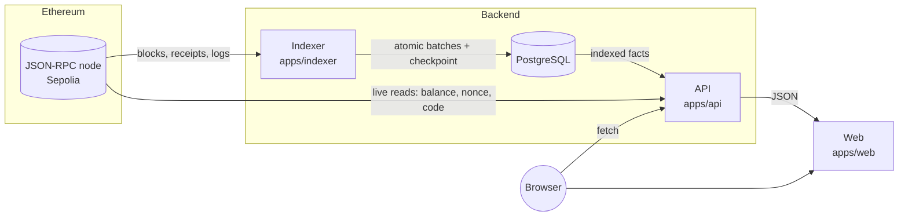

# Architecture

## Overview

The indexer is the **only** writer of chain-derived data. The API reads Postgres and
makes a small number of live RPC calls for state that is inherently "current" (balance,
nonce, bytecode). The web app never talks to Ethereum for indexing work; it only calls
the API.

## Monorepo layout

| Path                  | Responsibility                                                                                 |
| --------------------- | ---------------------------------------------------------------------------------------------- |
| `apps/indexer`        | Block indexer: fetch → transform → persist, checkpoint, reorg recovery, health server          |
| `apps/api`            | Fastify HTTP API, address analysis services, heuristics, "Explain this wallet"                 |
| `apps/web`            | Next.js UI, TanStack Query, SVG visualisations                                                 |
| `packages/blockchain` | `BlockchainProvider` + `EvmProvider`, ABIs, decoding, token events, protocol registry, retries |
| `packages/database`   | Drizzle schema, SQL migrations, repositories, PGlite test harness                              |
| `packages/shared`     | DTOs, Zod schemas (address/hash/search), enums, chain metadata                                 |
| `packages/config`     | Typed environment parsing (Zod), URL redaction                                                 |
| `contracts`           | `OnChainIntelligenceRegistry` (Solidity, Foundry)                                              |
| `scripts`             | demo, protocol verification, secret scan, local Postgres                                       |

Dependency direction is strictly downward: `apps/* → packages/*`, and
`blockchain`/`database` → `shared`. `database` does not import `blockchain`: the indexer
translates RPC types into database rows (`BlockBundle`), so storage stays independent of
the client library.

## Key flows

### Indexing a batch

1. Read the checkpoint (`sync_state`). Resolve the start block from config on first run.
2. Compute the **safe head** = `latest − CONFIRMATIONS`.
3. Fetch blocks `[next, min(next + batch − 1, safeHead)]` concurrently, each with its
   receipts (`eth_getBlockReceipts` by block hash, with per-transaction fallback).
4. Verify continuity: the first block's `parentHash` must equal the checkpoint hash, and
   each block must extend the previous one. A mismatch triggers reorg recovery.
5. Transform to rows (pure function, `bundle-builder.ts`), decode token transfers.
6. Persist everything **plus the new checkpoint** in one database transaction.
7. Fetch metadata (name/symbol/decimals/ERC-165) for newly observed tokens.

### Serving an address

`AddressService` combines indexed aggregates (SQL) with three cached RPC reads. The
response always includes `coverage` (the indexed block range), so the UI can say what
the numbers are based on.

## Design principles

- **Facts, inferences, heuristics are typed differently** (`EvidenceBasis`), all the
  way to the UI badges.
- **Pure core, thin shells**: transformation, decoding and classification are pure
  functions; I/O lives in repositories and the provider.
- **Dependency injection at the edges**: `buildApp(ctx)` and `new Indexer(options, deps)`
  take their dependencies, which is how tests run against PGlite and fake chains.
- **No silent fallbacks**: unknown is reported as unknown (`kind: 'unknown'`,
  `Unknown contract interaction`, `metadataStatus: 'failed'`).

See the ADRs in [`docs/adr`](adr) for the reasoning behind the main choices.
