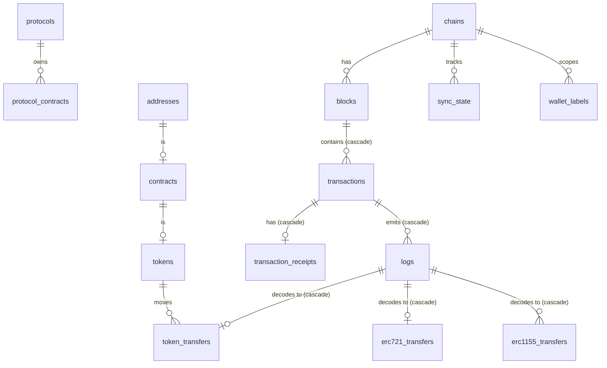

# Data model

Schema: [`packages/database/src/schema.ts`](../packages/database/src/schema.ts).
Migrations: [`packages/database/drizzle`](../packages/database/drizzle) (generated by
drizzle-kit, committed, applied by `npm run db:migrate` or the `migrate` compose service).

## Types

| Value                    | Postgres type   | TypeScript                    | Why                                                             |
| ------------------------ | --------------- | ----------------------------- | --------------------------------------------------------------- |
| Block number, nonce      | `bigint`        | `bigint`                      | int8 is enough; JS `number` is not safe above 2^53              |
| uint256 (value, amounts) | `numeric(78,0)` | `bigint`                      | 2^256−1 has 78 digits; never passes through `Number`            |
| Address                  | `varchar(42)`   | `` `0x${string}` `` lowercase | readable, indexable; see [ADR-006](adr/006-hex-text-storage.md) |
| Hash                     | `varchar(66)`   | `` `0x${string}` `` lowercase | same                                                            |
| Calldata / log data      | `text`          | `` `0x${string}` ``           | unbounded                                                       |
| Timestamps               | `timestamptz`   | `Date`                        | block time in UTC                                               |

`CHECK` constraints enforce lowercase hex on `blocks.hash` and `addresses.address`, so a
mixed-case write fails loudly instead of creating a duplicate identity.

## Tables

| Table                  | Primary key                                       | Notes                                                                   |
| ---------------------- | ------------------------------------------------- | ----------------------------------------------------------------------- |
| `chains`               | `id` (chain id)                                   | Every chain-scoped row references it                                    |
| `blocks`               | `(chain_id, number)`                              | unique `(chain_id, hash)`; root of the reorg cascade                    |
| `transactions`         | `(chain_id, hash)`                                | FK → blocks **ON DELETE CASCADE**; `selector` denormalised from `input` |
| `transaction_receipts` | `(chain_id, transaction_hash)`                    | status, gas used, effective gas price, created contract                 |
| `logs`                 | `(chain_id, block_number, log_index)`             | topics split into 4 columns for indexing                                |
| `token_transfers`      | `(chain_id, block_number, log_index)`             | ERC-20; FK → logs (cascade) and → tokens                                |
| `erc721_transfers`     | same                                              | `token_id numeric(78,0)`                                                |
| `erc1155_transfers`    | `(… , log_index, batch_index)`                    | one row per id/value pair of a `TransferBatch`                          |
| `addresses`            | `(chain_id, address)`                             | kind (`eoa`/`contract`/`unknown`) **and the evidence source**           |
| `contracts`            | `(chain_id, address)`                             | deployer & deployment tx when observed; `interfaces token_standard[]`   |
| `tokens`               | `(chain_id, address)`                             | standard, self-declared metadata, `metadata_status`                     |
| `protocols`            | `id`                                              | mirrored from the in-code registry                                      |
| `protocol_contracts`   | `(chain_id, address)`                             | address → protocol + role                                               |
| `wallet_labels`        | `id`, unique `(chain_id, address, label, source)` | every label names its source (e.g. `protocol-registry:uniswap`)         |
| `sync_state`           | `(chain_id, indexer_id)`                          | checkpoint: last block number + hash, and the coverage start            |

### What is deliberately not stored

- `logsBloom`, state roots, signatures (`v,r,s`): not needed by any feature and large.
- Balances: they change with every block and are read live with the block height.
- First/last seen: derived from indexed rows by query rather than maintained counters,
  because counters would also have to be reversed on every reorg.

## Reorg safety in the schema

Everything derived from a block is reachable from `blocks` through cascading foreign
keys, so `DELETE FROM blocks WHERE number > N` removes it all in one statement. Rows not
owned by a single block (`addresses`, `contracts`, `tokens`) carry `first_observed_block`
and are deleted explicitly during rollback. See [ADR-005](adr/005-reorg-handling.md).

## Indexes

Chosen from the actual query shapes (see [performance.md](performance.md)):

- `transactions (chain_id, from_address, block_number, transaction_index)` and the same
  for `to_address`: address history with keyset pagination, newest first.
- `token_transfers / erc721 / erc1155 (chain_id, from_address, block_number)`,
  `(…, to_address, …)`, `(…, token_address, …)`: per-address and per-token flows.
- `logs (chain_id, transaction_hash)`: events of a transaction; `(chain_id, address, block_number)`:
  activity of a contract; `(chain_id, topic0)`: event-type scans.
- Partial indexes: `transaction_receipts (contract_address) WHERE NOT NULL`,
  `tokens (…) WHERE metadata_status = 'pending'` (the metadata work queue).
